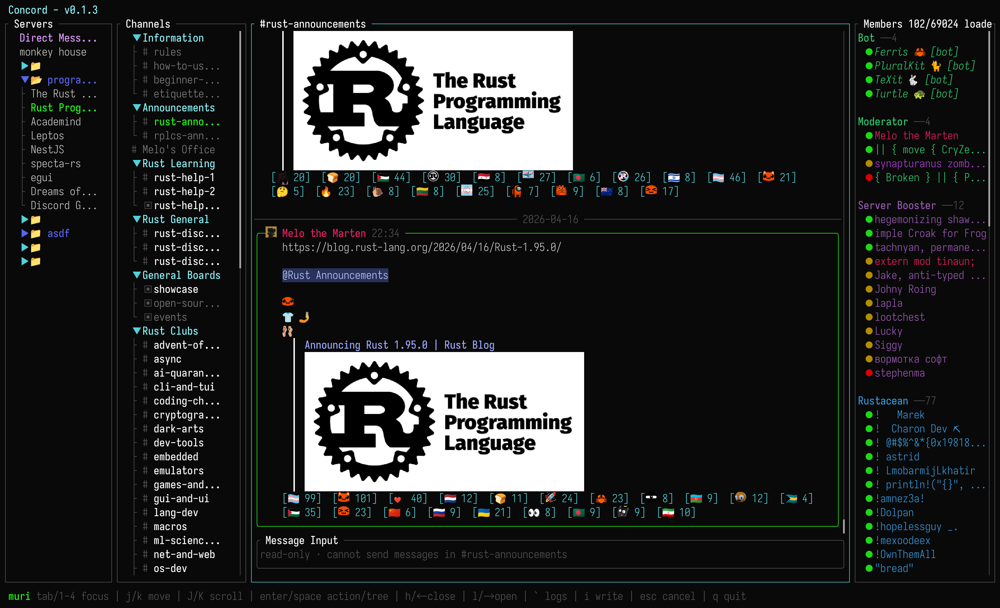

# Concord

Concord is a terminal user interface client for Discord. Full Discord experience, right in your terminal.



## Features

### Authentication

- **Token** : paste an existing Discord token.
- **Email / Password** : login with credentials. MFA (TOTP, SMS) is fully supported.
- **QR Code** : scan the code from the Discord mobile app.

Tokens are saved to `~/.concord/credential` in plain text. See the Security section below for details.

### Guilds & Channels

- Browse servers with guild folder grouping
- Navigate text channels, threads, and forum channels
- View and filter forum posts (active / archived)
- Load pinned messages per channel
- Open channel actions for pinned messages, thread lists, and mark-as-read
- Track unread messages and mention counts per channel

### Messaging

- Send, edit, and delete messages
- Reply to specific messages
- Use @mention autocomplete while composing messages
- View full message history with pagination
- Rich content display (embeds, attachments, stickers, and mentions)
- Message action menu for reply, edit, delete, open thread, show profile,
  pin/unpin, reactions, poll votes, and attachment/image actions

### Reactions & Polls

- View, add, and remove emoji reactions (Unicode and custom server emoji)
- Browse who reacted with a specific emoji
- View and vote on polls

### Media & Images

- Inline image previews directly in the terminal
- Avatar and custom emoji rendering
- Download attachments to `~/Downloads`
- Full-screen image viewer with navigation

Image rendering is powered by [ratatui-image](https://github.com/benjajaja/ratatui-image). On startup, Concord queries the terminal to detect the best available graphics protocol. Supported protocols:

- **Kitty Graphics Protocol** - Kitty, WezTerm, Ghostty, etc.
- **iTerm2 Inline Images** - iTerm2, WezTerm, mintty, etc.
- **Sixel** - foot, mlterm, xterm (if compiled with Sixel support), etc.
- **Halfblocks** (fallback) - works on any terminal, but uses block characters instead of true pixels.

If your terminal does not support any graphics protocol, images will be rendered as halfblock approximations. For the best experience, use a terminal that supports the Kitty or iTerm2 protocol.

You can toggle image viewing on or off in the configuration file. When image viewing is off, attachments and emojis will be shown as text placeholders.

### Members & Profiles

- Member list with grouping
- Presence indicators (Online, Idle, DND, Offline)
- User profile popups with guild-specific details

### Typing Indicators & Read State

- Live "user is typing..." indicators
- Unread message tracking with mention counts
- Mark channels as read

### Navigation & Keybindings

Concord has a four-pane layout like Discord.
**Guilds (1)**, **Channels (2)**, **Messages (3)**, **Members (4)**

With vim-style navigation:

| Key                       | Action                               |
| ------------------------- | ------------------------------------ |
| `1` `2` `3` `4`           | Focus pane                           |
| `Tab`                     | Cycle focus                          |
| `j` / `k`, arrows         | Move down / up                       |
| `J`, `K` / `H`, `L`       | Scroll viewport                      |
| `Ctrl+d` / `Ctrl+u`       | Half-page scroll                     |
| `g` / `G`, `Home` / `End` | Jump or scroll to top / bottom       |
| `Enter` / `Space`         | Open or activate the selected item   |
| `i`                       | Text insert mode                     |
| `a`                       | Action menu for the focused item     |
| `o`                       | Options menu                         |
| `Esc`                     | Close popup, cancel mode, or go back |
| `q` / `Ctrl+c`            | Quit                                 |

Action menus show local shortcuts next to each item. For example, message
actions use keys such as `e` for edit and `d` for delete. List-style dialogs,
such as emoji and poll pickers, use numbered shortcuts when that is clearer.

In the composer, `Enter` sends, `Shift+Enter` inserts a newline, and `Esc`
cancels. When the @mention picker is open, use `Up` / `Down`, `Ctrl+p` /
`Ctrl+n`, `Tab`, or `Enter` to choose a mention.

Mouse support is also available: click to focus or select rows, double-click to
open or activate items, and use the wheel to scroll panes and popups.

### Configuration

Display options are stored in `~/.concord/config.toml`:

- Disable all image previews with one master switch
- Toggle inline image previews
- Set image preview quality for attachments, embeds, and the image viewer
- Toggle avatar display
- Toggle custom emoji rendering

You can change these from the in-app Options menu, and Concord saves them back
to the config file.

Example:

```toml
[display]
disable_image_preview = false
show_avatars = true
show_images = true
image_preview_quality = "balanced"
show_custom_emoji = true
```

`image_preview_quality` supports these values:

- `efficient`: smaller preview requests to reduce bandwidth and memory use.
- `balanced`: default quality with bounded resource use.
- `high`: sharper resized previews using lossless quality.
- `original`: request the original source image for previews when possible.

This setting only applies to attachment, embed, and image viewer previews.
Avatars and custom emoji keep their separate small-image behavior.

## Performance

Concord is designed to stay lightweight in normal terminal use. In observed
typical use, it usually uses about 20-40 MB of memory.

Image-heavy screens can temporarily use more memory because compressed image
bytes need to be decoded before they can be rendered in the terminal. When many
images are loaded, memory can briefly rise to around 100-200 MB while decoding
and then drop again as work completes and caches are pruned.

To keep resource usage bounded, Concord limits media work in several places:

- Attachment previews are downloaded with an 8 MiB per-preview cap.
- Attachment downloads are capped at 64 MiB.
- Up to 4 attachment previews are fetched at once.
- Up to 2 inline image previews are decoded at once.
- Inline image previews, avatars, and custom emoji use small LRU caches.
- Image preview requests prefer resized Discord proxy URLs sized for the
  terminal instead of original full-size media when possible.
- The preview quality preset can lower preview source dimensions or opt into
  original source images. It does not change avatar or custom emoji sizing.

Message history is also cached with a per-channel limit, so long-running
sessions do not keep every message in memory forever.

## Install

### Homebrew

```sh
brew install chojs23/tap/concord
```

### Cargo

```sh
cargo install --git https://github.com/chojs23/concord
```

### GitHub Release installer

Install the latest release with the cargo-dist shell installer:

```sh
curl --proto '=https' --tlsv1.2 -LsSf https://github.com/chojs23/concord/releases/latest/download/concord-installer.sh | sh
```

The installer places `concord` under `$CARGO_HOME/bin`, which is usually
`~/.cargo/bin`. Make sure that directory is on your `PATH` before running
`concord`.

### Build from source

You need the Rust stable toolchain and Cargo.

```sh
git clone https://github.com/chojs23/concord.git
cd concord
cargo build --release
```

The release binary is produced at:

```sh
target/release/concord
```

## FAQ

### Can my account be blocked?

In day-to-day use, I have not seen an account block after several months of using Concord.
There was one path that did trigger a temporary block: trying to create new DM channel and send a message to an unknown user immediately blocked my account for 30 minutes. That feature has been removed. Other supported features have not caused blocks in my testing.

That said, Concord is not an official Discord client. Using unofficial clients, automated user accounts, or self-bots can violate Discord's Terms of Service, so there is always some risk. Use it at your own discretion.

### Does Concord support CAPTCHA?

No. If Discord requires a CAPTCHA during login, use token login instead.

## Security

- Tokens are stored as **plain text** in `~/.concord/credential`. So keep that file secure and do not share it. You can use the token from that file to log in to the official Discord client, so treat it like a password.
- On Unix, the config directory is created with `0700` and the credential file with `0600` permissions.
- No system keychain integration yet.

## License

Concord is licensed under GPL-3.0-only.
