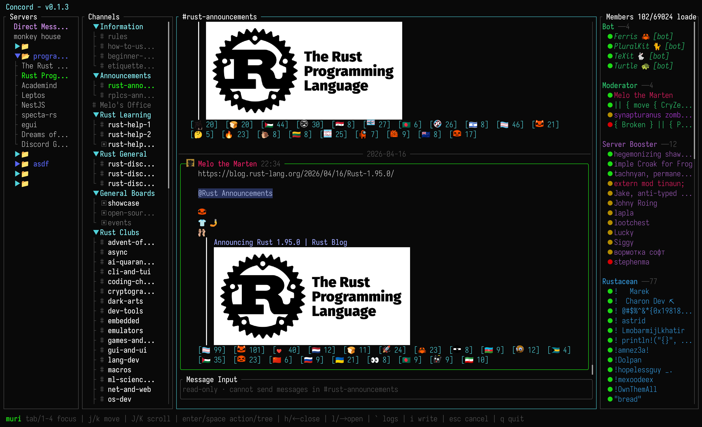
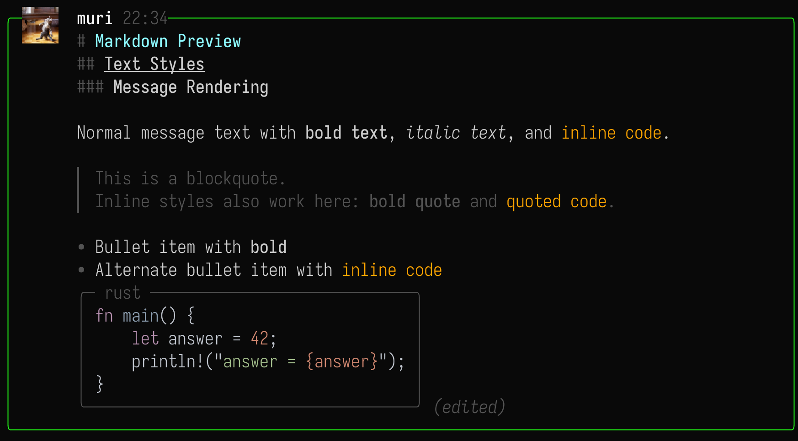

# Concord



Concord is a feature-rich TUI client for Discord, written in Rust with ratatui.

## Table of contents

- [Installation](#installation)
- [Features](#features)
- [Configuration](#configuration)
- [Performance](#performance)
- [Debug mode](#debug-mode)
- [FAQ](#faq)
- [Security](#security)
- [Contributing](#contributing)
- [License](#license)

## Installation

Release builds include voice playback and stream broadcasting.

### **Cargo**

```sh
cargo install concord --locked
```

Cargo installations compile Concord locally and require the build dependencies
listed below.

### **Homebrew**

```sh
brew install concord

# or install the latest release from tap
brew install chojs23/tap/concord
```

### **npm**

```sh
npm install -g @chojs23/concord
```

### **Nix**

```sh
# nixpkgs
nix profile install nixpkgs#concord-tui

# Latest GitHub release
nix profile install github:chojs23/concord
```

### **Gentoo**

This package is maintained by a community contributor and is not yet available in Gentoo GURU.

Install the `darwincereska` overlay:

```sh
eselect repository add darwincereska git https://codeberg.org/darwincereska/gentoo-overlay.git
emaint sync -r darwincereska
emerge -av net-im/concord
```

### Prebuilt releases

Download an archive for Linux, macOS, or Windows from the
[latest GitHub release](https://github.com/chojs23/concord/releases/latest), or
run the release installer:

```sh
curl --proto '=https' --tlsv1.2 -LsSf https://github.com/chojs23/concord/releases/latest/download/concord-installer.sh | sh
```

```powershell
powershell -ExecutionPolicy Bypass -c "irm https://github.com/chojs23/concord/releases/latest/download/concord-installer.ps1 | iex"
```

The installer places `concord` under `$CARGO_HOME/bin`.

### Runtime requirements

macOS 13 or later is required. Linux release builds need these packages:

```sh
# Fedora
sudo dnf install alsa-lib libva mesa-libEGL pipewire-libs xdg-desktop-portal

# Debian or Ubuntu
sudo apt install libasound2 libegl1 libpipewire-0.3-0 libva-drm2 libva2 xdg-desktop-portal

# Arch Linux
sudo pacman -S alsa-lib libva mesa pipewire xdg-desktop-portal
```

Screen sharing requires the portal backend for your desktop environment.
Concord uses native H.264 hardware encoding when available: VA API on Linux,
VideoToolbox on macOS, and Media Foundation on Windows. If hardware encoding is unavailable, Concord falls back to software encoding.

### Build from source

<details>
<summary>Build dependencies and commands</summary>

Install the Rust stable toolchain and the native dependencies for your platform:

```sh
# macOS
xcode-select --install
brew install cmake pkg-config
brew install nasm # Intel only

# Fedora
sudo dnf install alsa-lib-devel clang-devel cmake gcc gcc-c++ libva-devel nasm pipewire-devel pkgconf-pkg-config

# Debian or Ubuntu
sudo apt install build-essential cmake libasound2-dev libclang-dev libpipewire-0.3-dev libva-dev nasm pkg-config

# Arch Linux
sudo pacman -S alsa-lib base-devel clang cmake libva mesa nasm pipewire pkgconf
```

Windows source builds require the MSVC Rust toolchain, Visual Studio 2022 Build
Tools with Desktop development with C++, CMake, and NASM.

```sh
git clone https://github.com/chojs23/concord.git
cd concord
cargo build --release
```

To keep voice support without stream broadcasting:

```sh
cargo build --release --no-default-features --features voice-playback
```

To build without local voice playback, microphone, or stream broadcasting:

```sh
cargo build --release --no-default-features
```

The same feature flags can be passed to `cargo install concord --locked`.

</details>

## Features

### Authentication

- **Token** : paste an existing Discord token.
- **Email / Password** : login with credentials. MFA (TOTP, SMS) is fully supported.
- **QR Code** : scan the code from the Discord mobile app.
- **CONCORD_TOKEN env var** : set `CONCORD_TOKEN=your-token` before launching Concord. It overrides every `credentials.store` mode (`auto`, `keychain`, `plain`).

Email and QR code logins may trigger a CAPTCHA challenge on Discord's side. We cannot solve that, so I strongly recommend using token authentication.

By default, tokens are saved in the system keychain when available. In the
default `auto` mode, Concord falls back to its state directory when keychain
storage is unavailable. See the Security section below for details.

### Voice calls

- Voice calls with push-to-talk
- Noise suppression
- Watch and broadcast screen shares

### Guilds & Channels

- View, filter, and create forum/media posts (active / archived)
- Switch channels, threads, and posts with the fuzzy channel switcher (`Space`, `Space`)

### Messaging

- Search messages with filters using `/`
- `@mention` autocomplete
- Send custom emoji your account cannot use directly as image links when enabled
- Rich content display (embeds, attachments, stickers, and mentions)
- Detect URLs in message bodies and markdown links, then open them in your default browser

#### Markdown Rendering & Code syntax highlighting



Concord renders a practical subset of Discord-style Markdown in message bodies:

- Headings: `# H1`, `## H2`, `### H3`
- Quotes: `> quoted text`
- Bullets: `- item` and `* item`
- Inline styles: `**bold**`, `*italic*`, `__underline__`, `~~strikethrough~~`, and `` `inline code` ``
- Fenced code blocks with optional language labels, rendered as compact boxes with syntax highlighting
- Raw URLs and markdown link destinations are underlined and can be opened from message actions

### Media Support

Image rendering is powered by [ratatui-image](https://github.com/benjajaja/ratatui-image). On startup, Concord queries the terminal to detect the best available graphics protocol. Supported protocols:

- **Kitty Graphics Protocol** - Kitty, WezTerm, Ghostty, etc.
- **iTerm2 Inline Images** - iTerm2, WezTerm, mintty, etc.
- **Sixel** - foot, mlterm, xterm (if compiled with Sixel support), etc.
- **Halfblocks** (fallback) - works on any terminal, but uses block characters instead of true pixels.

Check the [compatibility matrix](https://github.com/ratatui/ratatui-image#compatibility-matrix) for terminals that support each protocol.

External media playback is off by default. You can enable it with Display options menu.
Video and audio playback, including live streams, uses [mpv](https://mpv.io/). Make sure `mpv` is installed and in your PATH.
YouTube playback depends on your local `mpv` setup, such as `yt-dlp` support.

To broadcast, join a voice channel, open its channel actions, choose
`Share screen` or use `<leader>vs` voice shortcut.
Linux screen capture depends on the active X11 or Wayland support.

### Rich Presence

- Concord serves the local `discord-ipc` socket, detects connected apps, and
  lets you pick which one to share from your profile's activity picker
- Only apps that speak Discord's Rich Presence (RPC/IPC) protocol are detected.
- Toggle with `share_rich_presence` under `[presence]` in `config.toml`

### Notifications

- Notification inbox (`<leader>n`) with Unreads and Mentions tabs.
- Custom notification sounds using WAV files
- Voice join and leave notification sounds while you are connected to voice

### Navigation & Keyboard shortcuts

> ⚠️ Keymap action names and default bindings may have breaking changes between releases.

All default key settings in this section can be customized. See
[Keymap options](./docs/keymap-options.md) for the config and supported actions.

With default vim-style navigation:

| Key                                       | Action                                          |
| ----------------------------------------- | ----------------------------------------------- |
| `1` `2` `3` `4`                           | Focus pane                                      |
| `Tab` / `Shift+Tab`                       | Cycle focus forward / backward                  |
| `h` / `l`, `←` / `→`                      | Move focus left / right                         |
| `j` / `k`, `↑` / `↓`, `Ctrl+n` / `Ctrl+p` | Move down / up                                  |
| `J`, `K` / `H`, `L`                       | Scroll viewport                                 |
| `Ctrl+d` / `Ctrl+u`                       | Half-page scroll                                |
| `Alt+h/l/←/→`                             | Resize focused pane width                       |
| `gg` / `G`                                | Jump or scroll to top / bottom                  |
| `Enter`                                   | Open or activate the selected item              |
| `/`                                       | Filter Guilds/Channels, search Messages/Members |
| `Space`                                   | Open leader shortcut window                     |
| `i`                                       | Text insert mode, or forum post composer        |
| `Esc` / `q`                               | Close popup, cancel mode, or go back            |
| `q`                                       | Quit Concord                                    |

`Ctrl+n` and `Ctrl+p` are fixed row movement keys. The default `j` and `k`
row movement keys are `SelectNext` and `SelectPrevious` and can be changed in
`keymap.toml`.

#### Leader key

Press `Space` to open the leader shortcut window.

| Key sequence     | Action                            |
| ---------------- | --------------------------------- |
| `Space`, `1`     | Toggle the Servers pane           |
| `Space`, `2`     | Toggle the Channels pane          |
| `Space`, `4`     | Toggle the Members pane           |
| `Space`, `a`     | Open actions for the focused pane |
| `Space`, `p`     | Open my profile settings          |
| `Space`, `o`     | Choose concord option category    |
| `Space`, `n`     | Open the notification inbox       |
| `Space`, `v`     | Open voice shortcuts              |
| `Space`, `Space` | Open the fuzzy channel switcher   |

#### Message shortcuts

These shortcuts act on the selected message when the Messages pane is focused.

| Key | Action                     |
| --- | -------------------------- |
| `y` | Copy message text          |
| `r` | Add or remove a reaction   |
| `R` | Reply                      |
| `d` | Delete                     |
| `e` | Edit                       |
| `o` | Open URL                   |
| `x` | Play video or audio        |
| `v` | Open the attachment viewer |

#### Action menus

Press `Space`, `a` to open actions for the focused pane. The menu shows the
available shortcuts and dims actions that do not apply to the current
selection.

#### Composer

The composer supports copied file attachments and editing the current draft in
`$EDITOR`. Pending uploads appear above the input before sending.

#### Emoji picker

Supports searching and selecting emoji with the picker. Press `:` to open the
picker, then type to filter.

When `emojis_as_links` is enabled, custom emoji your account cannot send
directly are inserted as Discord image links instead.

#### Bot commands

When the composer input starts with `/`, Concord shows available application
commands.

## Configuration

Concord reads `config.toml`, `keymap.toml`, and `theme.toml` from
`$XDG_CONFIG_HOME/concord` when `XDG_CONFIG_HOME` is set, or from the platform
config directory otherwise.

Machine-local UI state and fallback credentials are stored in
`$XDG_STATE_HOME/concord`, or in `~/.local/state/concord` when
`XDG_STATE_HOME` is not set.

### App options

<details>
<summary>Default config</summary>

```toml
[display]
# Image protocol: auto, iterm2, kitty, sixel, or halfblocks.
image_protocol = "auto"

# Master switch that hides all image previews when true.
disable_image_preview = false

# Show user avatars next to messages and in profile views.
show_avatars = true

# Render inline image previews for attachments and embeds.
show_images = true

# Allow video and audio media to open in an external player.
media_playback = false

# Preview quality: efficient, balanced, high, or original.
image_preview_quality = "balanced"

# Attachment viewer quality: efficient, balanced, high, or original.
attachment_viewer_quality = "original"

# Render custom Discord emoji as images when possible.
show_custom_emoji = true

# Crop avatars into circles instead of showing square images.
circular_avatars = false

[composer]
# Send custom emoji your account cannot use directly as image links.
emojis_as_links = false

[presence]
# Relay Rich Presence from local apps as your activity.
share_rich_presence = true

[credentials]
# Credential storage: auto, keychain, or plain.
# auto tries the system keychain first and falls back to the state file.
store = "auto"

[notifications]
# Show desktop notifications for Discord messages that pass notification rules.
desktop_notifications = true

# Optional notification icon to include in notifications. May not work on all platforms.
# When unset, no icon is used. It must either be a name of an icon (typically in /usr/share/icons)
# or a path to an icon.
notification_icon = "/path/to/icon.svg"

# Optional WAV files for message, voice join/leave notification sounds.
# When unset, Concord uses built-in generated tones.
notification_sound = "/path/to/message.wav"
voice_join_sound = "/path/to/join.wav"
voice_leave_sound = "/path/to/leave.wav"

[voice]
# Join or update Discord voice with Concord self-muted.
self_mute = false

# Join or update Discord voice with Concord self-deafened.
self_deaf = false

# Optional CPAL device IDs chosen from Voice Options. When omitted or no longer
# available, Concord uses the current system default input or output device.
# input_source = "CoreAudio:input-id"
# output_source = "CoreAudio:output-id"

# Allow microphone transmit while this session is joined and not self-muted.
allow_microphone_transmit = false

# Require holding the configured shortcut to transmit.
push_to_talk = false

# Global push-to-talk shortcut. The key works even when Concord is not focused.
# Modifiers can be combined before the key, for example "control+shift+F8".
push_to_talk_shortcut = "F8"

# Reduce steady background microphone noise.
noise_suppression = true

# Voice activity threshold in dB. Lower values transmit quieter input.
microphone_sensitivity = -30

# Microphone input volume percentage, from 0 to 200.
microphone_volume = 100

# Received voice playback volume percentage, from 0 to 200.
voice_output_volume = 100
```

macOS may require Input Monitoring permission for Concord or the terminal that
started it. On Linux Wayland, the compositor manages global shortcuts, so
Concord cannot guarantee that the shortcut input also reaches the focused
application.

</details><br>

### Key bindings

See [Keymap options](./docs/keymap-options.md) for the config format and
supported actions.

<details>
<summary>Default keymap config</summary>

```toml
[keymap]
leader = "space"
StartComposer = "i"
OpenPaneFilter = "/"
ClosePopup = "q"
OpenDebugLog = "`"
FocusGuildPane = "1"
FocusChannelPane = "2"
FocusMessagePane = "3"
FocusMemberPane = "4"
SelectNext = "j"
SelectPrevious = "k"
CycleFocusNext = { keys = ["tab", "l", "right"] }
CycleFocusPrevious = { keys = ["<S-tab>", "h", "left"] }
HalfPageDown = "<C-d>"
HalfPageUp = "<C-u>"
ScrollViewportDown = "J"
ScrollViewportUp = "K"
JumpTop = "gg"
JumpBottom = "G"
ScrollHorizontalLeft = "H"
ScrollHorizontalRight = "L"
ResizePaneLeft = { keys = ["<A-h>", "<A-left>"] }
ResizePaneRight = { keys = ["<A-l>", "<A-right>"] }
Quit = "q"
CopyMessage = "y"
ReactMessage = "r"
ReplyMessage = "R"
DeleteMessage = "d"
EditMessage = "e"
OpenMessageUrl = "o"
PlayMedia = "x"
ViewMessageAttachment = "v"
ToggleGuildPane = "<leader>1"
ToggleChannelPane = "<leader>2"
ToggleMemberPane = "<leader>4"
OpenFocusedPaneAction = "<leader>a"
OpenCurrentUserProfile = "<leader>p"
OpenOptions = "<leader>o"
OpenNotificationInbox = "<leader>n"
ChannelSwitcher = "<leader><leader>"
VoiceDeafen = "<leader>vd"
VoiceMute = "<leader>vm"
ToggleStream = "<leader>vs"
VoiceLeave = "<leader>vl"

[keymap.groups]
"<leader>v" = "Voice"

[keymap.notification_inbox_actions]
MarkRead = "r"
MarkAllRead = "a"

[keymap.guild_actions]
MarkAsRead = "m"
ToggleMute = "u"
LeaveServer = "l"
FolderSettings = "r"

[keymap.channel_actions]
JoinVoice = "e"
LeaveVoice = "l"
ToggleStream = "s"
WatchStream = "w"
VoiceParticipantAudio = "a"
ShowPinnedMessages = "p"
ShowThreads = "t"
MarkAsRead = "m"
ToggleMute = "u"

[keymap.message_actions]
CopyMessage = "y"
ReactMessage = "r"
ReplyMessage = "R"
DeleteMessage = "d"
EditMessage = "e"
OpenMessageUrl = "o"
RemoveMessageEmbeds = "D"
PlayMedia = "x"
ViewMessageAttachment = "v"
GoToReferencedMessage = "g"
ShowMessageProfile = "p"
PinMessage = "P"
OpenThread = "t"
ShowReactionUsers = "u"
OpenPollVotePicker = "c"

[keymap.member_actions]
ShowProfile = "p"

[keymap.thread_actions]
MarkAsRead = "m"
ToggleFollow = "f"
Close = "c"
Lock = "l"
Edit = "e"
CopyLink = "y"
ToggleMute = "u"
NotificationSettings = "n"
Pin = "P"
Delete = "d"
CopyId = "i"

[keymap.composer]
OpenEditor = "<C-e>"
PasteClipboard = "<C-v>"
InsertNewline = { keys = ["<C-j>", "<S-enter>", "<C-enter>", "<A-enter>"] }
Submit = "enter"
Close = "esc"
ClearInput = "<C-c>"
RemoveLastAttachment = "delete"
DeletePreviousChar = "backspace"
DeletePreviousWord = { keys = ["<A-backspace>", "<C-backspace>", "<C-w>"] }
DeleteToLineStart = "<C-u>"
DeleteToLineEnd = "<C-k>"
MoveCursorUp = "up"
MoveCursorDown = "down"
MoveCursorWordLeft = "<C-left>"
MoveCursorLeft = "left"
MoveCursorWordRight = "<C-right>"
MoveCursorRight = "right"
MoveCursorHome = "home"
MoveCursorEnd = "end"
ToggleReplyPing = "<A-p>"
```

</details><br>

### Theme

See [Theme options](./docs/theme-options.md) for available groups, values, and
border shapes.

<details>
<summary>Default theme config</summary>

<!-- default-theme-config:start -->

```toml
# Complete Highlight Group reference with Concord's built-in defaults.
# Copy this configuration to `theme.toml` in the Concord config directory,
# then keep only the groups you want to override.
#
# A group accepts `link`, `foreground`, `background`, `bold`, `italic`, `dim`,
# `underline`, and `strikethrough`. Colors accept `none`, `terminal_default`, a
# canonical lowercase ANSI name, or six-digit RGB such as `#39ff14`. `none`
# clears that color channel after inheritance. A linked group inherits fields
# it does not set. Use `link = "none"` to detach a built-in link.

# Border shapes are UI geometry rather than Highlight Group styles. An omitted
# surface uses `default`. These values reproduce Concord's built-in layout.
[ui.border]
default = "plain"
composer = "rounded"
message = "rounded"
forum = "rounded"

[highlight.Normal]
foreground = "terminal_default"
background = "terminal_default"

[highlight.Strong]
bold = true

[highlight.Emphasis]
italic = true

[highlight.Muted]
dim = true

[highlight.Title]
link = "Strong"

[highlight.Heading]
link = "Strong"

[highlight.Decoration]
link = "Muted"

[highlight.Hint]
link = "Muted"

[highlight.Description]
link = "Muted"

[highlight.Shortcut]
link = "Muted"

[highlight.Activity]
link = "Muted"

[highlight.ChannelTypeMarker]
link = "Muted"

[highlight.FieldLabel]
link = "Muted"

[highlight.SearchContext]
link = "Muted"

[highlight.Timestamp]
link = "Muted"

[highlight.Placeholder]
link = "Muted"

[highlight.Disabled]
link = "Muted"

[highlight.Loading]
link = "Muted"

[highlight.Edited]
link = "Muted"
italic = true

[highlight.Unavailable]
link = "Muted"
strikethrough = true

[highlight.LoginTitle]
link = "Title"
foreground = "cyan"

[highlight.LoginHint]
link = "Muted"

[highlight.PaneTitle]
link = "Title"

[highlight.ModalTitle]
link = "Title"

[highlight.ComposerTitle]
link = "Title"

[highlight.HeaderTitle]
link = "Title"
foreground = "cyan"

[highlight.HeaderLabel]
link = "Muted"

[highlight.MessageAuthor]
link = "Strong"

[highlight.MessageTimestamp]
link = "Timestamp"

[highlight.CategoryHeading]
link = "Heading"

[highlight.MemberGroupHeading]
link = "Heading"

[highlight.MessageSecondary]
link = "Muted"

[highlight.ForumSecondary]
link = "Muted"

[highlight.EmbedAuthor]
link = "Emphasis"

[highlight.EmbedTitle]
link = "Strong"
foreground = "blue"

[highlight.EmbedFieldName]
link = "Strong"
underline = true

[highlight.EmbedFooter]
link = "Muted"
italic = true

[highlight.CodeBlockBorder]
link = "Border"
dim = true

[highlight.ScrollbarTrack]
link = "ScrollbarThumb"
dim = true

[highlight.UnavailableEmoji]
link = "Unavailable"

[highlight.HeaderError]
link = "Error"
bold = true

[highlight.HeaderWarning]
link = "Warning"
bold = true

[highlight.Border]
foreground = "dark_gray"

[highlight.FocusBorder]
foreground = "cyan"

[highlight.Selection]
foreground = "cyan"
background = "none"
bold = true
dim = false

[highlight.SelectionBorder]
foreground = "green"
bold = true

[highlight.PaneBorder]
link = "Border"

[highlight.FocusedPaneBorder]
link = "FocusBorder"
bold = true

[highlight.LoginBorder]
link = "FocusBorder"

[highlight.ComposerBorder]
link = "Border"

[highlight.ActiveComposerBorder]
link = "FocusBorder"
bold = true

[highlight.ModalBorder]
link = "FocusBorder"
bold = true

[highlight.ComposerPickerBorder]
link = "FocusBorder"

[highlight.SelectedRow]
link = "Selection"

[highlight.SelectionMarker]
link = "Selection"

[highlight.ActiveField]
foreground = "cyan"
bold = true

[highlight.ActiveTab]
link = "Selection"

[highlight.MessageSelectedBorder]
link = "SelectionBorder"

[highlight.ForumBorder]
link = "FocusBorder"

[highlight.ForumSelectedBorder]
link = "SelectionBorder"

[highlight.ScrollbarThumb]
foreground = "#AAAAAA"

[highlight.UnreadNotice]
foreground = "cyan"
bold = true

[highlight.Editing]
foreground = "yellow"

[highlight.Reaction]
foreground = "cyan"

[highlight.SelfReaction]
foreground = "yellow"

[highlight.PresenceOnline]
foreground = "green"

[highlight.PresenceIdle]
foreground = "#B48C00"

[highlight.PresenceDnd]
foreground = "red"

[highlight.PresenceOffline]
link = "Normal"
dim = true

[highlight.VoiceDisabled]
foreground = "yellow"

[highlight.VoiceConnection]
foreground = "yellow"
bold = true

[highlight.FolderFallback]
foreground = "cyan"

[highlight.NavigationActive]
foreground = "green"
bold = true

[highlight.NavigationMentioned]
foreground = "#FFA500"

[highlight.NavigationNotified]
foreground = "terminal_default"

[highlight.NavigationUnread]
foreground = "terminal_default"

[highlight.MentionBadge]
foreground = "#FFA500"

[highlight.NotificationBadge]
foreground = "terminal_default"

[highlight.JoinedVoiceChannel]
foreground = "yellow"
bold = true

[highlight.VoiceSpeaking]
foreground = "green"
bold = true

[highlight.ReplyPingEnabled]
foreground = "cyan"

[highlight.Tag]
foreground = "cyan"

[highlight.RelationshipFriend]
foreground = "green"

[highlight.RelationshipIncoming]
foreground = "yellow"

[highlight.RelationshipOutgoing]
foreground = "yellow"

[highlight.RelationshipBlocked]
foreground = "red"

[highlight.RelationshipNone]
foreground = "terminal_default"
dim = true

[highlight.GaugeFill]
foreground = "cyan"

[highlight.MessageBody]
foreground = "terminal_default"

[highlight.MarkdownHeading1]
link = "Heading"
foreground = "cyan"

[highlight.MarkdownHeading2]
link = "Heading"
underline = true

[highlight.MarkdownHeading3]
link = "Heading"

[highlight.MarkdownQuote]
foreground = "dark_gray"

[highlight.MarkdownMarker]
foreground = "dark_gray"

[highlight.MessageAttachment]
foreground = "cyan"

[highlight.ImageOverflow]
link = "MessageAttachment"
bold = true

[highlight.InlineCode]
foreground = "#FFA500"

[highlight.MessageLink]
foreground = "cyan"
underline = true

[highlight.MentionSelf]
foreground = "yellow"
background = "#5C4C23"

[highlight.MentionOther]
foreground = "#C1CEF7"
background = "#28325C"

[highlight.MentionRole]
# Discord supplies the foreground and a darker role-color background by default.
# This group controls colored role mentions that do not notify the current user.
# Notifying role mentions use MentionSelf with the Discord role foreground.

[highlight.MentionPickerRole]
foreground = "magenta"

[highlight.EmbedGutter]
foreground = "red"

[highlight.EmbedLink]
foreground = "blue"
underline = true

[highlight.CommandName]
link = "MessageSecondary"
foreground = "#5865F2"

[highlight.SystemThreadName]
foreground = "cyan"
bold = true

[highlight.PollAnswerSelected]
foreground = "terminal_default"
bold = true

[highlight.PollWinner]
foreground = "terminal_default"
bold = true

[highlight.UnreadBanner]
foreground = "terminal_default"
background = "#5865F2"

[highlight.UnreadDivider]
foreground = "#ED4245"

[highlight.ForumPinnedBadge]
foreground = "yellow"
bold = true

[highlight.BotBadge]
link = "Normal"
background = "#5865F2"
bold = true

[highlight.Error]
foreground = "red"

[highlight.Warning]
foreground = "yellow"

[highlight.Success]
foreground = "green"

[highlight.Info]
foreground = "cyan"
```

<!-- default-theme-config:end -->

</details><br>

## Performance

Concord is designed to stay lightweight in normal terminal use. In observed
typical use, it usually uses about 20-40 MB of memory.

Image-heavy screens can temporarily use more memory because compressed image
bytes need to be decoded before they can be rendered in the terminal. When many
images are loaded, memory can briefly rise to around 100-200 MB while decoding
and then drop again as work completes and caches are pruned.

## Debug mode

Run `CONCORD_DEBUG=1 concord`. Logs are written to `concord.log` in the Concord
config directory.

## FAQ

### Can my account be blocked?

There are some path that did trigger a temporary block:

- If your account is new or has a low reputation, some actions may trigger a block.
- Trying to **create a new DM channel and send a message to an unknown user**(meaning there was no pre-existing DM created through the Discord client) can immediately block your account temporarily.
- Sending a message in an existing one-to-one DM may also trigger a temporary account block if you only recently started messaging that person or have little conversation history with them.
- Some features that requires a hCapcha challenge.

Other features have not caused blocks in my testing.

That said, Concord is not an official Discord client. Using unofficial clients, automated user accounts, or self-bots can violate Discord's TOS, so there is always some risk. Use it at your own discretion.

## Security

- By default, tokens are stored in the system keychain when available.
- The `CONCORD_TOKEN` environment variable lets you provide a token without writing it to disk. This avoids leaving plaintext on disk, but the token is visible in `/proc/<pid>/environ` and in process listings while Concord is running.
- In `credentials.store = "auto"`, Concord falls back to **plain text** credentials under Concord's state directory when keychain storage is unavailable. In `keychain` mode, Concord does not fall back to plain storage. Keep fallback credential files secure and do not share them. You can use a token from that file to log in to the official Discord client, so treat it like a password.
- On Unix, the fallback credential's parent directory is created with `0700` and the credential file with `0600` permissions.

## Contributing

Any issues, pull requests, and feedback are welcome. See [CONTRIBUTING.md](./CONTRIBUTING.md) for details.

## License

Concord is licensed under GPL-3.0-only.
